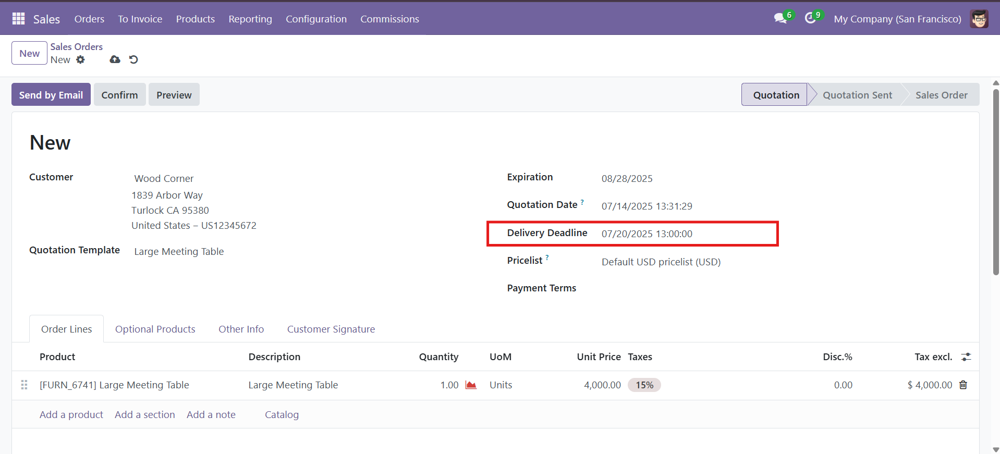
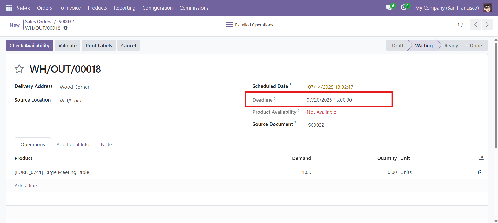
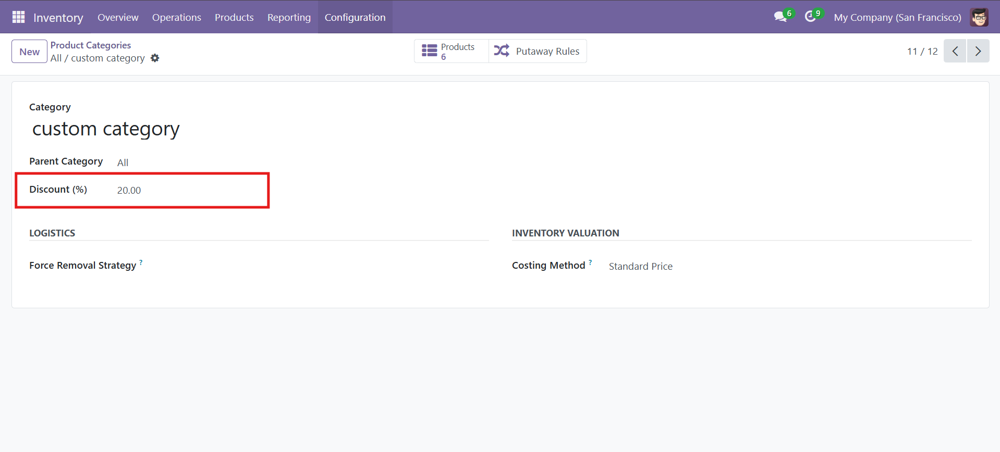
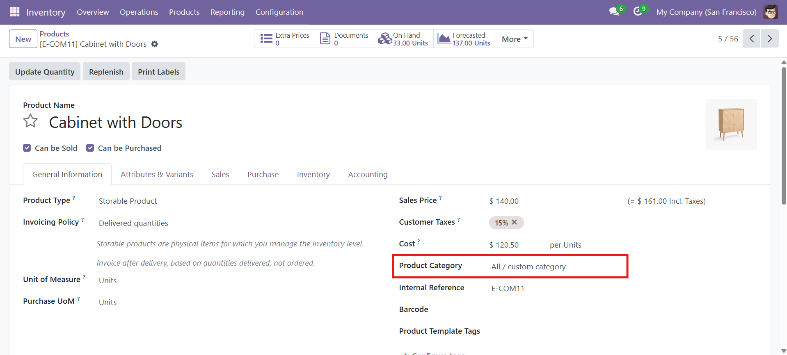
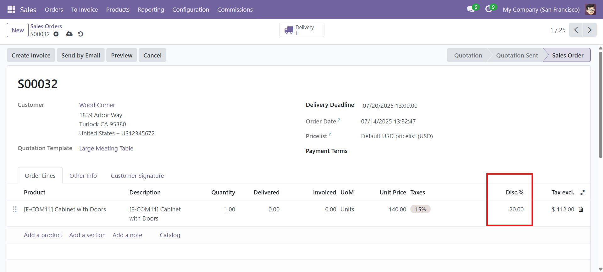
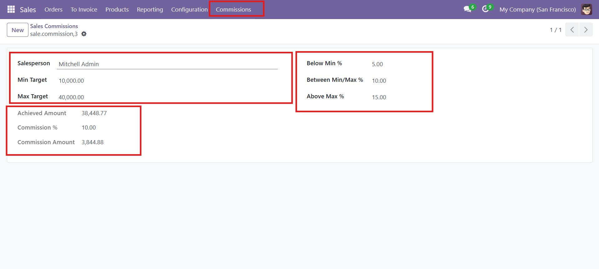

# Odoo17_Sale_Enhancements

Custom Odoo module to enhance the Sales application with additional functionality, including delivery date tracking, category-based discounts, and user commission logic.

---

## 📦 Module Features

### ✅ 1. **Custom Delivery Date on Sale Orders**
- Adds a **Delivery Date** field to the sale order form to manage expected delivery.


📸 Screenshot:





---

### ✅ 2. **Category-Based Discount**
- Add a discount directly on the product category. When you select a product from that category in a sale order, the discount applies automatically.

📸 Screenshot:







---

### ✅ 3. **Sales Commission by User**
- Each salesperson can be assigned a **commission percentage**.


📸 Screenshot:



---

## 🧩 Technical Details

### 🔗 Dependencies
- `sale_management`
- `contacts`
- `stock`

### 📁 Project Structure

```
sale_enhancements/
│
├── models/
│   ├── __init__.py
│   ├── product_category.py        
│   ├── sale_commission.py       
│   ├── sale_order.py             
│   └── sale_order_line.py         
│
├── security/
│   ├── commission_groups.xml
│   └── ir.model.access.csv
│
├── views/
│   ├── product_category_views.xml
│   ├── sale_commission_views.xml
│   └── sale_order_views.xml
│
├── __init__.py
├── __manifest__.py

```

---

## ⚙️ Installation

1. Clone the repository into your Odoo `addons/` directory:
   ```bash
   git clone https://github.com/MahmoudYousrry/odoo17_sale_enhancements.git
   ```

2. Restart the Odoo server.

3. Activate the developer mode.

4. Install the module from the **Apps** menu.

---

## 🧪 Usage

- **To use the Delivery Date field**: Open any Sale Order and set the `Delivery Date`.
- **To configure Category Discounts**: Go to *Products > Product Categories* and set a `Line Discount`.
- **To manage Commissions**: Go to *Sales > Commissions* and set up commission percentages per user.

---

